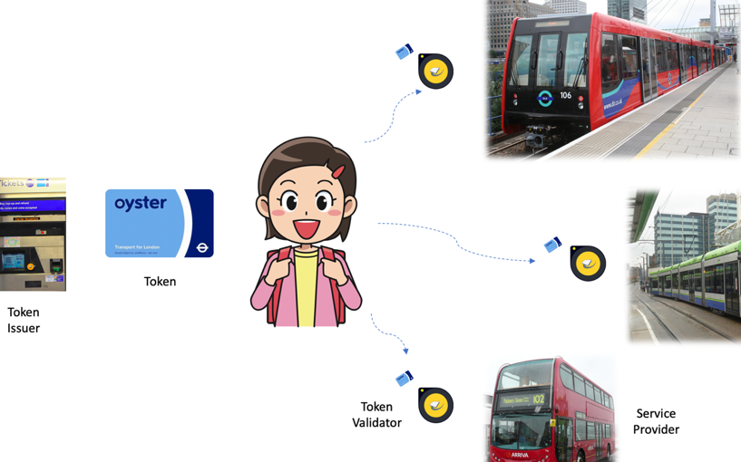
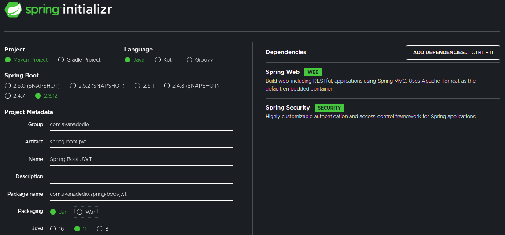

# Integrando Azure Spring Cloud com Azure Security Center

## Autenticação com Spring Boot e Auth0

### JWT - JSON Web Token

Para manter a segurança de APIs, uma das formas mais comuns de autenticação com Spring Boot é o JWT, gerando chave (toke), que ao ser gerado é utilizado nos demais APIs por tempo determinado.
 

 
### Auth0

Implementa regras para geração do JWT de maneira simples.

Este componente possui a implementação de diversos algoritmos para simplificar a geração e leitura do token.
 

### Lombok

Apos gerar o arquivo Spring Boot, foi-se estruturado o projeto inicial no IntelliJ importando o arquivo Spring Boot Baixado como um modulo existente.

Partiu-se entao para produçao do codigo para autenticar usuario e codigo para processar as requisicoes.
 

Pacotes criados: data, service, security*

 
### Criando Modelo view-controller

Neste ponto foi criado testes de autenticacao do usuario e desenvolvi codigo de login. Ao final deste processo, foi utilizado o Postman para realizar testes.

Pacotes criados: controller, security.

## Spring Boot Azure 

Criar conta - 30 dias grátias com 930 reais

Ir para o portal da Azure -> Azure Active Directory

Create tenant - nome do projeto, description OBS: Guardar as chaves

Criar Secret key e Permissoes da API(nesse caso Directory -> Directory.AccessasUser.All)

Criar conta - 30 dias grátias com 930 reais

criar directory - criar aplicacao - criar permissoes - criar segredos - criar usuarios - criar grupos - adicionar usuarios no grupo -

References

https://dzone.com/articles/securing-spring-boot-microservices-with-json-web-t